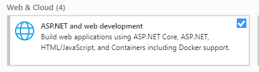
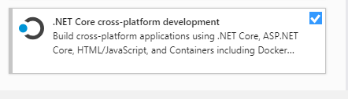
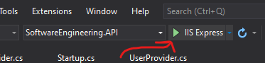

# COSC4353

Group 11 project for COSC 4353 with Singh

## Building

### Prerequisites
- [Visual Studio 2019 Community](https://visualstudio.microsoft.com/vs/community/)
    - When installing, make sure you select these "Workloads":

    

    

- [Node.js](https://nodejs.org/en/)

### Running

Open `SoftwareEngineering.sln` in Visual Studio 2019. Once open, Visual Studio will automatically start downloading the C# dependencies that this project needs to run.

To start the project, press the "Start debugging" button that looks like this:

💡 *Note: The project's very first run might take some time to start. This is because Visual Studio installs the React/Node.js dependencies on the very first-run. The following times the project is started will be much faster.*

## HW3 Instructions

In this assignment you will build the back end for the web application that you designed in assignment 1. 
Remember, we are only building back end in this assignment.

Description: 
Same as assignment 1.

Additional Details:

Back end must include following components/modules:

- Login module
- Client Profile Management module
- Fuel Quote module, includes list of quote history for a client.
- Pricing module. Only create a class. You will implement this in last assignment.

Important deliverables:
- You should have validations in place for required fields, field types, and field lengths in backend code as well. 
- All backend code should be covered by unit tests. Code coverage should be grater than 80%. 
- Research how to run the code coverage reports. Each IDE has plugins to generate reports. Here are few pointers. https://stackify.com/code-coverage-tools/
- All front end should be connected to back end. Form data should be populated from backend. Backend should receive data from front end, validate, and prepare to persist to DB.
- WE ARE NOT IMPLEMENTING DB yet. For this assignment you can hard code the values.
P

- NOTE: Only provide a word / pdf doc. You should use GitHub for your group collaboration and code.

Answer these questions:
1. Provide link to GitHub repository for TAs to view the code.(5 points)

2. List what backend technologies you are using and why? (2 points)
3. Provide code coverage report. (3 points)
4. IMPORTANT: list who did what within the group. TAs should be able to validate in GitHub, otherwise team members who didn't contribute will receive a ZERO.

What to turn in: 
- Only soft copy uploaded to BlackBoard before due date. 
- DO NOT SUBMIT CODE to BlackBoard. 

- Only one submission per group.
- No extensions.
- All group members must contribute equally.
